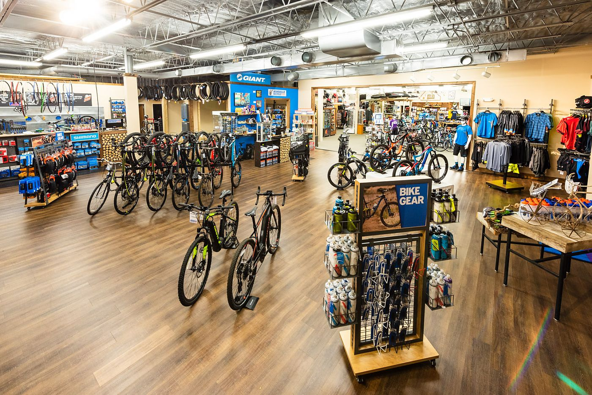
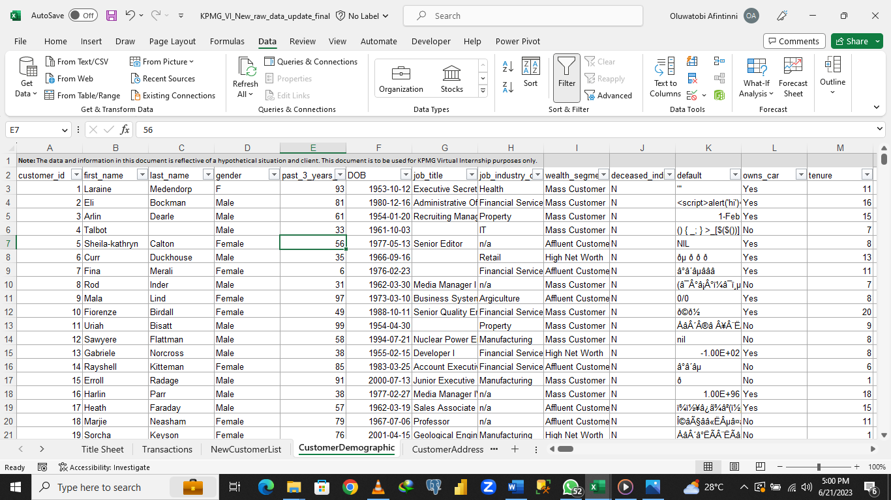
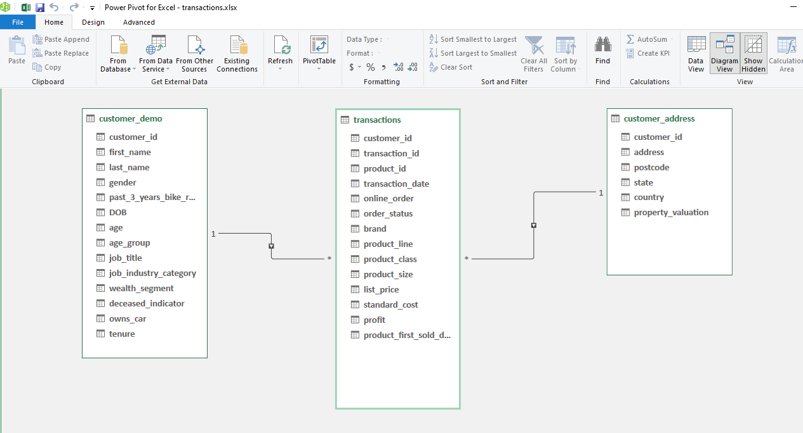
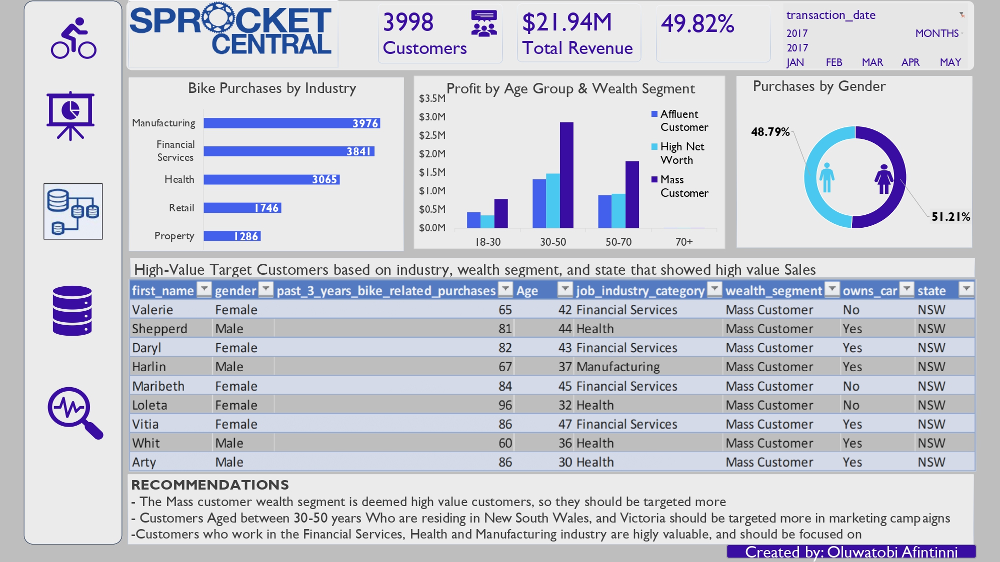
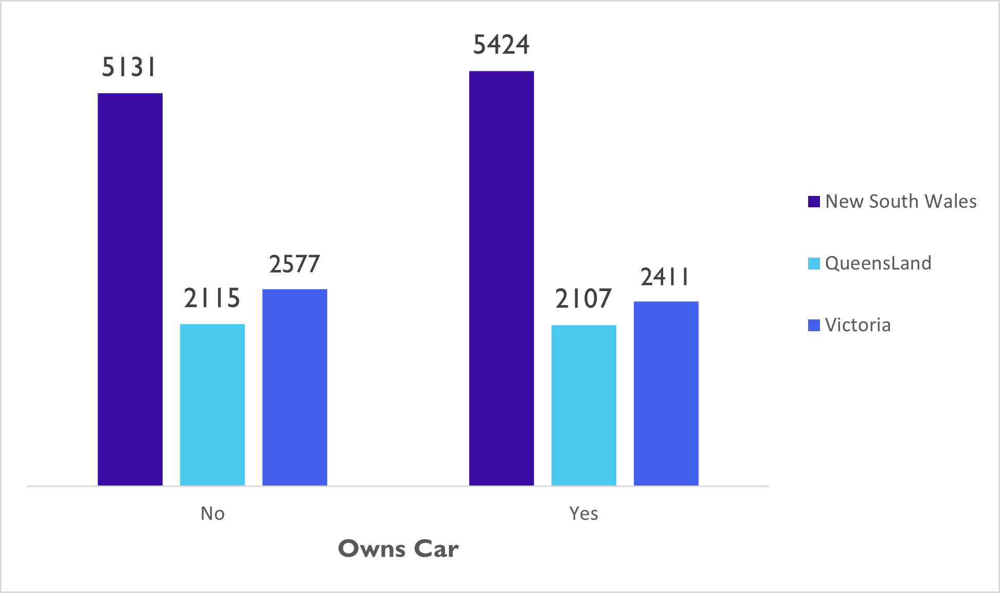

# SPROCKET- CENTRAL-Marketing-Analysis

## INTRODUCTION
SPROCKET CENTRAL is a mid-sized company selling bicycles and accessories.  Primarily, Sprocket Central Pty Ltd needs help with its customer and transaction data. 
The organization has a large dataset relating to its customers, but its team is unsure how to effectively analyze it to help optimize its marketing strategy. 

The client provided US(KPMG) with 3 datasets for analysis, and 1 dataset(New Customers) for predicting and Recommendation

- Customer Demographic 
- Customer Addresses
- Transactions data in the past 3 months
- New Customers

## PROBLEM STATEMENT
Provide data-driven Insights with existing sales, demography, and customers data to aid new marketing 
You decide to start the preliminary data exploration and identify ways to improve the quality of Sprocket Central Pty Ltd’s data.

## Tools Used
To transform, analyze and provide insights, the following tools were used

- Microsoft Excel 365
- Power Query
- Power Pivot

## Skills Demonstrated
- Data Manipulation
- Functions used (IFS AND functions, DATEDIF, COUNTIFS,Vlookups, Xmatch & Index Functions, LEFT, RIGHT, and Proper FUnctions)
- Power Pivot Measures
- Pivot Table Analyzers
- Filters & Slicers use in Excel necessary for our analysis

## DATA EXPLORATION & CLEANING
I explored the four datasets with Excel, where I noted data quality issues needed for cleaning and transformation. 
The links to the datasets are seen here- [2020]([https://https://www.kaggle.com/datasets/adriandiazny/sprocket-central-mock-data)

The original dataset contained 20,000 rows and 13 columns. There are 4002 distinct customers and 20,000 distinct transactions. 
The following steps break down the cleaning process I took in ensuring the dataset was clean, valid, and ready for analysis.

## DATA MODELLING 
After cleaning the dataset, I employed the use of Power Pivot to create relationships between the tables and created a model that
was connected by the customer_ids

## DATA ANALYSIS & VISUALIZATION
The dashboard contains 1 highly interactive page of the report. It was created to provide insights and answer the business pressing questions for the marketing team. 
You can interact with the dashboard [here](https://conquers-my.sharepoint.com/:x:/g/personal/toby_conquers_onmicrosoft_com/ESh62gwe9b5CmwRIfc7uqhkB5N1a4rqq0p8CGBKE6urtCA?e=2ATlDX)).

In addition to our analysis, the chart below shows the sales distribution by state and car ownership status.
Our results indicate that customers from New South Wales are high-value customers as over 50% of sales come from that region. 

## INSIGHTS
1. Customers from the manufacturing and financial sectors have been the greatest contributors to sales volume for the company. New customers from these sectors should definitely be targeted.
2. New South Wales customers contributed the most to the sales volume of the company.
3. Out of the entire data, about 50% own a car. New Customers from this state should definitely be targeted
4. It is evident that the mass customer segment is the most profitable customer segment and the age group of 30-50 is the most profitable age group to the company.
5. The marketing team should focus on these segments and age groups as they pull in the highest amount of profit for the company.
6. The female gender contributed slightly more profit to the company than males. 

## RECOMEDNATIONS 
For the marketing team to optimize sales performance and profitability, these actions should be taken
1. A fairly good number of the highly valued customers will be female
2. Customers Working in the financial services, health, and manufacturing sectors,  Aged between 30-50 years Who are residing in New South Wales, and Victoria
   should be highly prioritized
3. Customers aged between 30- 50 and are in the mass customer segment should also be highly considered and sold to, as they have the best chance of bringing
   in profits, improved sales, and expansion.

### REFERENCES
1. https://https://www.kaggle.com/datasets/adriandiazny/sprocket-central-mock-data
2. https://www.techtarget.com/searchdatamanagement/definition/RFM-analysis#:~:text=What%20is%20RFM%20(recency%2C%20frequency%2C%20monetary)%20analysis%3F,and%20perform%20targeted%20marketing%20campaigns.

Thank you so much for going through this. Merci
